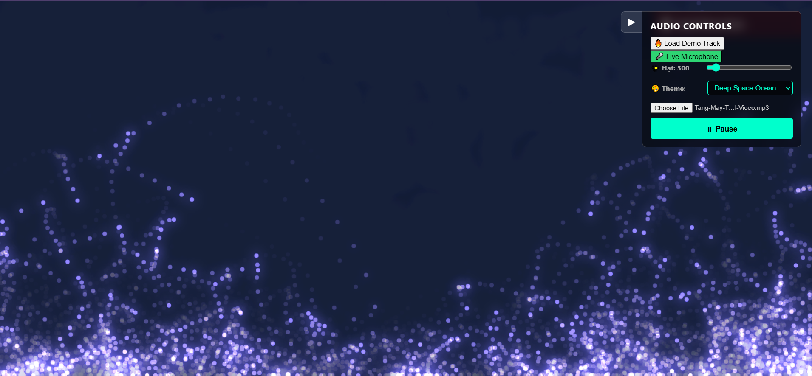

# 🎵 Audio-to-Physics Visualizer

Trình giả lập vật lý tương tác trực tiếp với tần số âm thanh theo thời gian thực. Bật bài nhạc yêu thích của bạn lên và quan sát các định luật cơ học (trọng lực, va chạm hạt đàn hồi, chuyển động Langevin/Brown) cùng hiệu ứng thị giác Neon "nhảy múa" theo từng nhịp điệu của dải âm Bass, Mid và Treble.



## 📖 1. Giới thiệu Dự án (Concept & Vision)

**Audio-to-Physics Visualizer** ra đời dành cho những ai vừa đam mê âm nhạc, vừa bị cuốn hút bởi vẻ đẹp của các mô phỏng vật lý trực quan. Dự án bóc tách phổ âm thanh (Audio Spectrum) thông qua Web Audio API, sau đó ánh xạ (mapping) trực tiếp các dải tần số này thành các biến số động lực học trong một vũ trụ giả lập. 

Đây là một dự án **Pure Frontend**, toàn bộ logic tính toán vật lý, đổ bóng ánh sáng và render đồ họa được xử lý 100% ở phía client-side (trình duyệt của người dùng) bằng một vòng lặp Game Loop tối ưu, đảm bảo trải nghiệm mượt mà không cần tới hạ tầng Backend hay Database đắt đỏ.


Bản cập nhật mới nhất đã phá vỡ giới hạn hiệu năng bằng **Rust & WebAssembly (WASM)**. Kết hợp cùng thuật toán phân lô không gian (Spatial Hash Grid) và kỹ thuật quản lý bộ nhớ Zero-Allocation (Mượn tham chiếu, triệt tiêu hoàn toàn độ trễ cấp phát bộ nhớ), engine giờ đây có thể gánh mượt mà **60FPS với hơn 5,000+ hạt** cùng lúc
---

## 🛠 2. Tech Stack & Công nghệ Cốt lõi

* **Frontend Framework:** React (Được scaffolding bằng Vite giúp tăng tốc độ khởi động và HMR).
* **Rendering Engine:** Pure HTML5 Canvas API (Không dùng thư viện ngoài để ép hiệu năng render thô ở mức cao nhất).
* **Audio Processing:** Web Audio API (`AudioContext`, `AnalyserNode`) tách phổ tần số thời gian thực.
* **Styling & Layout:** Inline styles kết hợp CSS Glassmorphism tạo giao diện Control Panel mờ ảo, hiện đại.
* **Physics Engine:** Rust & WebAssembly (WASM) với wasm-bindgen. Đảm nhận toàn bộ toán học và logic va chạm phức tạp, giao tiếp với JS qua bộ nhớ RAM phẳng (Shared Memory) để đạt tốc độ thực thi tối đa.

### ✨ 2.1 Các Tính Năng Nổi Bật (Key Features)

* 🚀 **Extreme Physics Engine (Rust + WASM):** Xử lý va chạm đàn hồi và cập nhật lực đẩy/hút cho 60,000 hạt mỗi khung hình. Bổ sung lực xoáy (Vortex Force) và giới hạn tốc độ (Terminal Velocity) giúp chuyển động hạt mượt mà tựa chất lỏng/dải ngân hà.
* 🎛️ **Unified Control Center:** Bảng điều khiển Glassmorphic chuẩn Cyberpunk, tự động thu gọn thông minh.
* 🎚️ **Logarithmic Particle Slider:** Thanh trượt số lượng hạt sử dụng thuật toán phi tuyến tính (Cubic Scale), giúp người dùng tinh chỉnh cực kỳ chính xác ở các mốc nhỏ (100 - 10,000) và scale mượt mà lên tận đỉnh 60,000 hạt.
* 🎵 **Pro Audio Player:** Tích hợp thanh tua nhạc (Seekbar) đồng bộ thời gian thực chuẩn Spotify. Hỗ trợ Load nhạc local, Demo Track hoặc Live trực tiếp qua Microphone.
* 🌟 **Dynamic Neon Glow:** Chế độ hòa trộn Additive Blending kết hợp dải màu giới hạn giúp tạo lõi sáng hạt tinh tế, chống chói lóa (blow-out) khi các hạt xếp chồng lên nhau ở mật độ cao. Hỗ trợ đa dạng Theme (Cyberpunk, Matrix, Volcanic, Ocean).
* 🛠️ **Developer Debug Mode:** Tích hợp bộ Visual Debug tách biệt, tự động ẩn trên môi trường Production.

Dự án không chỉ là một app React thông thường mà là sự kết hợp sâu giữa **Frontend (React + Three.js/WebGL)** và **Low-level Engine (Rust)**:
1. **Shared Memory Buffer:** Dữ liệu tọa độ hạt (X, Y) được Rust ghi trực tiếp lên một dải Flat Float32Array Memory. Javascript/WebGL sẽ đọc thẳng con trỏ bộ nhớ (Pointer) này để Render mà không cần tốn chi phí Serialize/Deserialize qua lại giữa JS và WASM.
2. **Zero-Clone Collision Resolution:** Thuật toán Spatial Hash Grid trong Rust được tối ưu hóa vòng lặp mượn tham chiếu (`&self.grid`), triệt tiêu hoàn toàn tác vụ sao chép mảng (`.clone()`) lặp lại hàng chục ngàn lần mỗi Frame, giúp tiết kiệm triệt để CPU Cycles.
---


## 📂 3. Cấu trúc Thư mục Dự án

```text
audio-physics-visualizer/
├── public/                    # Chứa các file tĩnh (favicon, demo.mp3, demo.png...)
├── src/
│   ├── components/
│   │   ├── CanvasEngine/
│   │   │   └── PhysicsCanvas.jsx # Lớp hiển thị Canvas & điều phối Game Loop
│   │   ├── Common/
│   │   │   ├── Toast.jsx         # Thông báo lỗi bằng toast 
│   │   ├── Controls/
│   │   │   ├── AudioPlayer.jsx   # Giao diện tải nhạc và điều khiển Play/Pause
│   │   │   └── DebugPanel.jsx    # Bật/tắt lưới không gian kiểm tra FPS
│   │   └── Layout.jsx            # Bố cục chia tầng lớp (Canvas vs UI Overlay)
│   ├── core/
│   │   ├── audio/
│   │   │   └── AudioAnalyzer.js  # Bộ phân tích dải tần số âm thanh (Bass/Mid/Treble)
│   │   ├── physics/
│   │   │   ├── Particle.js       # Logic chuyển động, lực tác động và va chạm hạt
│   │   │   └── SpatialHash.js    # Thuật toán phân mảnh không gian tối ưu va chạm
│   │   └── constants.js          # Hệ số cấu hình vật lý toàn cục
│   ├── hooks/
│   │   ├── useAudioStream.js     # Quản lý vòng đời Audio Context độc lập
│   │   └── useGameLoop.js        # Hook quản lý requestAnimationFrame đồng bộ
│   │   └── useGlobalError.js     # Hook xử lý các ngoại lệ
│   ├── App.jsx                   # Component gốc điều phối luồng dữ liệu
│   ├── index.css                 # CSS toàn cục khử cuộn màn hình
│   └── main.jsx                  # Điểm khởi chạy React DOM
├── Dockerfile                    # Cấu hình đóng gói Multi-stage với Nginx
├── package.json
└── README.MD                     # Tài liệu hướng dẫn dự án

```

---

## 🧮 4. Định luật Vật lý & Cơ chế Toán học Mô phỏng

Môi trường giả lập áp dụng một tổ hợp gồm nhiều định luật cơ học cổ điển và hiện đại kết hợp tác động lên vector vận tốc $\vec{v} = (v_x, v_y)$ và tọa độ $\vec{p} = (x, y)$ của từng hạt:

### 4.1. Hệ số Ma sát môi trường (Damping)

Tại mỗi khung hình, hạt chịu một lực cản môi trường tỷ lệ thuận với vận tốc hiện tại để tiêu tán năng lượng, tránh hệ thống bị bùng nổ động năng:


$$v_{new} = v_{old} \cdot (1 - \gamma_{damping})$$

### 4.2. Trọng lực Động học (Dynamic Gravity)

Trọng lực không cố định mà thay đổi tuyến tính theo biên độ năng lượng dải âm Bass ($A_{bass}$):


$$g_{dynamic} = g_{base} + k_{bass} \cdot A_{bass}$$

### 4.3. Chuyển động Nhiệt Nhiễu loạn (Langevin / Brownian Motion)

Âm Treble ($T_{treble}$) đại diện cho nhiệt năng môi trường. Tần số cao kích thích các hạt rung động ngẫu nhiên theo phương trình vi phân Langevin thông qua biến ngẫu nhiên $\xi$ (phân phối chuẩn trong khoảng $[-0.5, 0.5]$):


$$v_{x} \mathrel{+}= (Math.random() - 0.5) \cdot k_{treble} \cdot T_{treble}$$

$$v_{y} \mathrel{+}= (Math.random() - 0.5) \cdot k_{treble} \cdot T_{treble}$$

### 4.4. Lực Trung tâm theo Tần số Âm thanh (Audio-Driven Central Forces)

Các hạt chịu tác động đồng thời bởi hai lực hướng tâm và ly tâm đối nghịch hướng về tâm màn hình $\vec{p}_{center} = (W/2, H/2)$:

* **Lực hút Mid (Mid Pull Force):** Dải âm Mid kích hoạt lực hút kéo các hạt co cụm về tâm:

$$\vec{F}_{mid} = k_{mid} \cdot A_{mid} \cdot \vec{u}_{center}$$


* **Lực đẩy Bass (Bass Push Force):** Khi có nhịp trống (Bass drop) mạnh, một lực đẩy ly tâm cực đại xuất hiện, hất tung các hạt từ tâm ra biên biên màn hình:

$$\vec{F}_{bass} = - k_{bass\_push} \cdot A_{bass} \cdot \vec{u}_{center}$$


*(Trong đó $\vec{u}_{center}$ là vector đơn vị hướng từ hạt vào tâm màn hình).*

### 4.5. Cơ chế Tương tác Chuột & Sóng Xung kích (Mouse & Shockwave Forces)

* **Lực Hút Trọng Trường Chuột (Mouse Gravity Pull):** Khi người dùng di chuyển chuột hoặc chạm tay vào màn hình trong vùng bán kính $R_{mouse\_ radius}$, một lực hấp dẫn giả lập xuất hiện hút các hạt bám theo con trỏ chuột.
* **Sóng Xung Kích Click (Shockwave Explosion):** Khi nhấn chuột trái (`onMouseDown`), một vòng tròn sóng xung kích kích hoạt từ điểm click và mở rộng ra ngoài với vận tốc $v_{shockwave}$. Mọi hạt nằm trong phạm vi rìa sóng sẽ bị kích nổ động năng và đẩy lùi ra xa (`Shockwave Push Force`) một cách uy lực.

### 4.6. Phản ứng Va chạm Đàn hồi toàn phần (Elastic Particle Collision)

Khi khoảng cách giữa hai hạt nhỏ hơn tổng bán kính của chúng, thuật toán giải quyết va chạm theo 2 bước:

1. **Xử lý xuyên thấu (Overlap Resolution):** Đẩy hai hạt xa nhau một khoảng bằng nửa độ xuyên thấu dọc theo vector pháp tuyến nhằm tránh hiện tượng dính hạt.
2. **Bảo toàn động lượng (Impulse Resolution):** Tính toán xung lực đàn hồi truyền qua lại giữa hai thực thể:

$$\vec{v}_1' = \vec{v}_1 - \frac{2m_2}{m_1+m_2} \frac{\langle \vec{v}_1 - \vec{v}_2, \vec{p}_1 - \vec{p}_2 \rangle}{\|\vec{p}_1 - \vec{p}_2\|^2} (\vec{p}_1 - \vec{p}_2)$$


---

## 🎨 5. Hiệu ứng Đồ họa & Thị giác Neon (Neon Visual Effects)

Để tạo ra trải nghiệm thị giác rực rỡ mang phong cách Cyberpunk, engine render sử dụng các kỹ thuật xử lý ảnh nâng cao của Canvas API:

* **Hòa trộn màu sắc (Global Composite Operation):** Sử dụng chế độ hòa trộn `ctx.globalCompositeOperation = "lighter"` (hoặc `"screen"`), giúp các hạt khi chồng lấp lên nhau sẽ tự động cộng hưởng độ sáng, tạo ra các điểm sáng chói ấn tượng tại những vùng mật độ hạt cao.
* **Đổ bóng phát quang (Neon Glow):** Kích hoạt thuộc tính `shadowBlur` và `shadowColor` đồng màu với hạt, biến mỗi hạt thô thành một diode phát quang lấp lánh chìm trong không gian tối.
* **Đuôi mờ chuyển động (Motion Blur / Trails):** Thay vì xóa sạch Canvas ở đầu mỗi khung hình, hệ thống phủ một lớp sơn đen có độ mờ Alpha siêu nhỏ `rgba(0, 0, 0, 0.08)`. Kỹ thuật này giữ lại vệt mờ chuyển động của khung hình cũ, tạo nên những dải đuôi ánh sáng kéo dài cực kỳ uyển chuyển theo giai điệu bài hát.
* **Audio-reactive Background Glow (Nhịp thở không gian):** Thay vì nền tĩnh nhàm chán, hệ thống sử dụng không gian màu HSLA để điều khiển độ sáng (Lightness) của toàn bộ phông nền. Khi tiếng Bass dập mạnh, cả vũ trụ nền sẽ chớp sáng mượt mà theo nhịp điệu, mang lại cảm giác môi trường vật lý đang thực sự "thở" cùng bài hát.
* **Multi-Theme Color Presets (Đa dạng bộ lọc quang phổ):** Thuật toán màu sắc được thiết kế linh hoạt với 4 dải Theme tích hợp sẵn: *Cyberpunk Neon* (tự động luân chuyển vô tận), *Matrix Green*, *Volcanic Red* (ngả cam đỏ rực rỡ) và *Deep Space Ocean* (xanh thẳm tĩnh lặng).
---

## 🎤 6. Tính năng Âm thanh Nâng cao (Advanced Audio Features)

Không chỉ dừng lại ở việc phát nhạc tĩnh, dự án được thiết kế xử lý luồng dữ liệu âm thanh (Audio Routing) thông minh để đa dạng hóa trải nghiệm:

* **Live Microphone (Phản ứng theo giọng nói):** Ứng dụng gọi `navigator.mediaDevices.getUserMedia` để xin quyền thu âm trực tiếp. Web Audio API lập tức bóc tách giọng nói, tiếng vỗ tay, hoặc tiếng gõ bàn phím của bạn và phản hồi trực tiếp lên không gian hạt vật lý theo thời gian thực (Real-time).
* **Anti-Feedback Loop (Chống dội âm/Hú rít):** Hệ thống có cơ chế chuyển luồng thông minh. Khi người dùng bật Mic, ứng dụng tự động ngắt kết nối Node phân tích (`AnalyserNode`) khỏi Loa (`AudioContext.destination`) nhưng vẫn giữ nguyên kết nối tính toán FFT. Điều này ngăn chặn triệt để vòng lặp dội âm (Howling Loop) gây chói tai thường gặp ở các ứng dụng xử lý audio.
* **Instant Demo Track:** Tích hợp sẵn nhạc mồi (Demo Track EDM) tải trực tiếp từ thư mục public, giúp bất kỳ ai truy cập vào đều có thể test ngay độ "cháy" của app chỉ với 1 click mà không cần mất công tìm tải file MP3.

---

## 🚀 7. Tối ưu Hiệu năng với Thuật toán Spatial Hashing

Để render mượt mà **1,000+ hạt** cùng hàng loạt hiệu ứng chồng chéo ở tốc độ tối đa **60 FPS** mà không gây nghẽn CPU, hệ thống đã loại bỏ hoàn toàn vòng lặp quét va chạm cặp đôi thô bạo $O(N^2)$. Thay vào đó, dự án triển khai cấu trúc dữ liệu **Spatial Hashing (Lưới băm không gian)**:

1. Không gian màn hình được chia thành lưới Uniform Grid với kích thước mỗi ô bằng $16px$ (`SPATIAL_CELL_SIZE`).
2. Ở đầu mỗi khung hình, tọa độ thực $(x, y)$ của hạt được băm (hash) cực nhanh để tìm ra chỉ mục ô duy nhất:

$$\text{Key} = \text{cols} \cdot \lfloor y / \text{cellSize} \rfloor + \lfloor x / \text{cellSize} \rfloor$$


3. Khi thực hiện quét va chạm cho một hạt bất kỳ, hệ thống chỉ truy vấn danh sách các hạt nằm chung trong ô đó và $8$ ô lưới lân cận xung quanh. Độ phức tạp tính toán được giảm từ $O(N^2)$ xuống mức tiệm cận lý tưởng **$O(N)$**.

### 7.1. Dynamic Particle Scalability (Tùy chỉnh linh hoạt theo phần cứng)
Để giải quyết bài toán phân mảnh cấu hình thiết bị (từ PC Gaming đến Mobile), hệ thống tích hợp thanh trượt **Particle Count** cho phép người dùng thay đổi số lượng hạt từ `100` đến `3.000` ngay trong lúc (runtime) nhạc đang phát. 
Nhờ cơ chế điều chỉnh mảng thông minh (kết hợp hàm `push` và `splice`) cộng hưởng cùng sức mạnh của lưới Spatial Hashing, việc sinh thêm hoặc xóa đi hàng ngàn hạt diễn ra mượt mà, **không hề gây đứt gãy Game Loop hay Drop FPS**.

---

## 🎮 8. Hướng dẫn Cài đặt & Chạy Local

Khởi chạy ứng dụng trên môi trường local cực kỳ đơn giản qua 3 bước tiêu chuẩn:

```bash
# 1. Clone mã nguồn dự án về máy cá nhân
git clone [https://github.com/YOUR_USERNAME/audio-physics-visualizer.git](https://github.com/YOUR_USERNAME/audio-physics-visualizer.git)

# 2. Di chuyển vào thư mục dự án và cài đặt dependencies
cd audio-physics-visualizer
npm install


# 3. Cài đặt môi trường WebAssembly và Build Physics Core
# Đảm bảo máy bạn đã cài Rust (rustup)
cargo install wasm-pack
cd physics-core
wasm-pack build --target web
cd ..

# 4. Kích hoạt môi trường Local Development Server (Vite)
npm run dev


```

> Trình duyệt sẽ tự động mở hoặc bạn có thể truy cập thủ công vào đường link `http://localhost:5173`. Hãy tiến hành tải lên một file nhạc định dạng bất kỳ (`mp3`, `wav`, `m4a`...), nhấn nút **Play** và tận hưởng không gian vật lý âm nhạc!

> **💡 Mẹo trải nghiệm (Tips):** > - Truy cập vào Web, bấm nút **"🔥 Load Demo Track"** và bấm Play để quẩy ngay lập tức với bài nhạc EDM có sẵn. Hoặc bấm **"🎤 Live Microphone"** (Cấp quyền thu âm trên trình duyệt) và thử gõ nhịp lên mặt bàn hoặc hát để thấy vũ trụ vật lý "rùng mình" theo từng âm thanh của bạn!

---

## 🐳 9. Khởi chạy thông qua Đóng gói Docker

Dự án tích hợp sẵn tệp cấu hình Docker đa tầng (**Multi-stage build**) chuyên nghiệp giúp tối ưu dung lượng Production Image xuống mức siêu nhẹ (chỉ khoảng mươi Megabytes) bằng cách loại bỏ hoàn toàn thư mục `node_modules` thừa và chạy trực tiếp trên nền Web Server **Nginx** cao cấp:

```bash
# Thực hiện Build Docker Image chuyên dụng
docker build -t audio-physics-visualizer .

# Khởi chạy Container phân phối trên Port 8080
docker run -d -p 8080:80 --name audio-visualizer-container audio-physics-visualizer

```

> Truy cập ngay vào địa chỉ `http://localhost:8080` để nghiệm thu ứng dụng chạy qua môi trường Docker đóng gói biệt lập!
